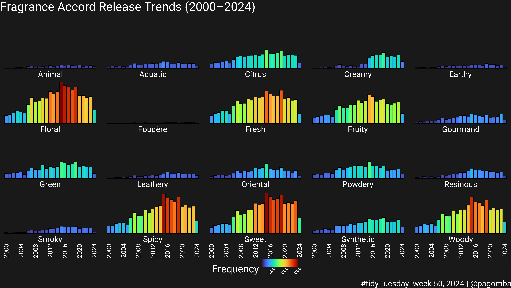
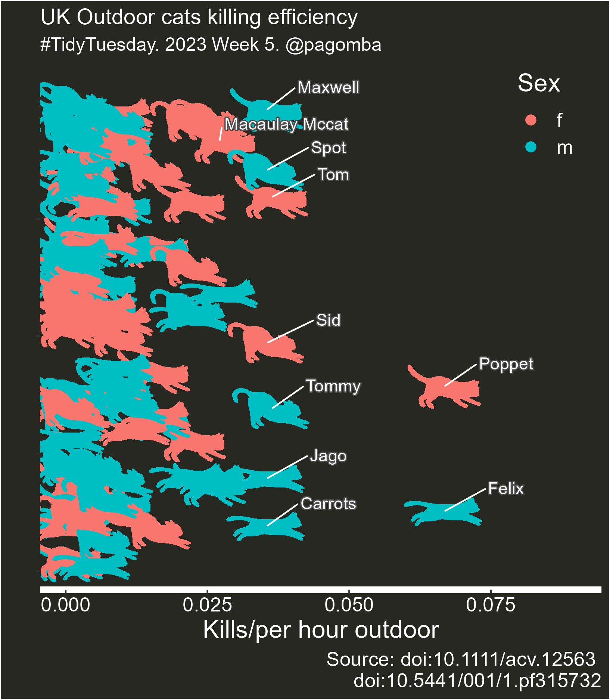

# #TidyTuesday

## 2024

### Week 50 - The scent of data ([code](https://github.com/pgomba/TidyTuesday/blob/main/2024/w_50/perfumes.R))

## 2023

### Week 5 - Pet Cats UK [(code)](https://github.com/pgomba/TidyTuesday/tree/main/2023/w5_cats) {alt="cats"}

## 2021

### Week 31 - Olympic Medals [(code)](https://github.com/pgomba/TidyTuesday/tree/main/2021/w31_Olimp)

###  other countries plots [(here)](https://github.com/pgomba/TidyTuesday/tree/main/2021/w31_Olimp/plots) \## Week 32 - Paralympic Medals [(code)](https://github.com/pgomba/TidyTuesday/tree/main/2021/w32_Para)   Week 48 - Dr.Who [(code)](https://github.com/pgomba/TidyTuesday/tree/main/2021/w48_drWho)  
